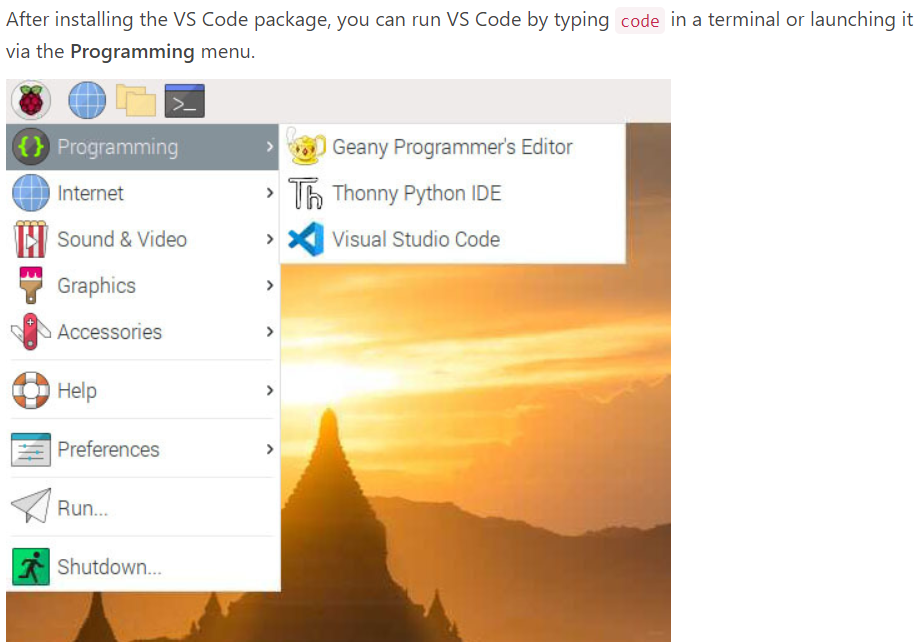
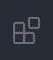
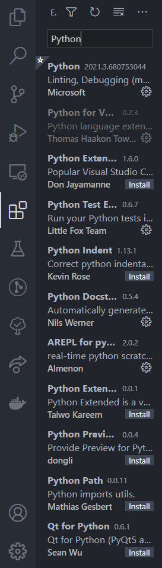
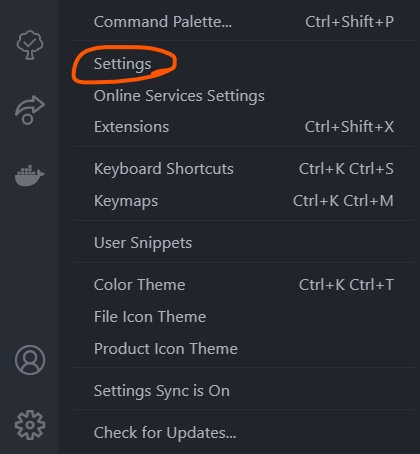
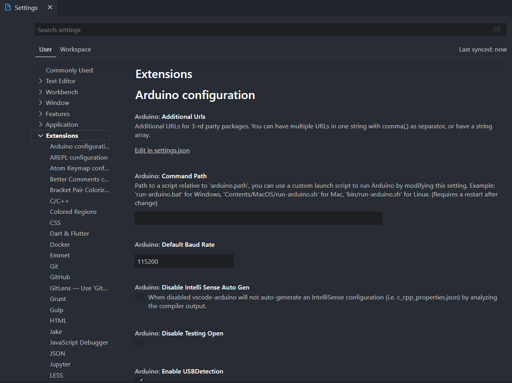
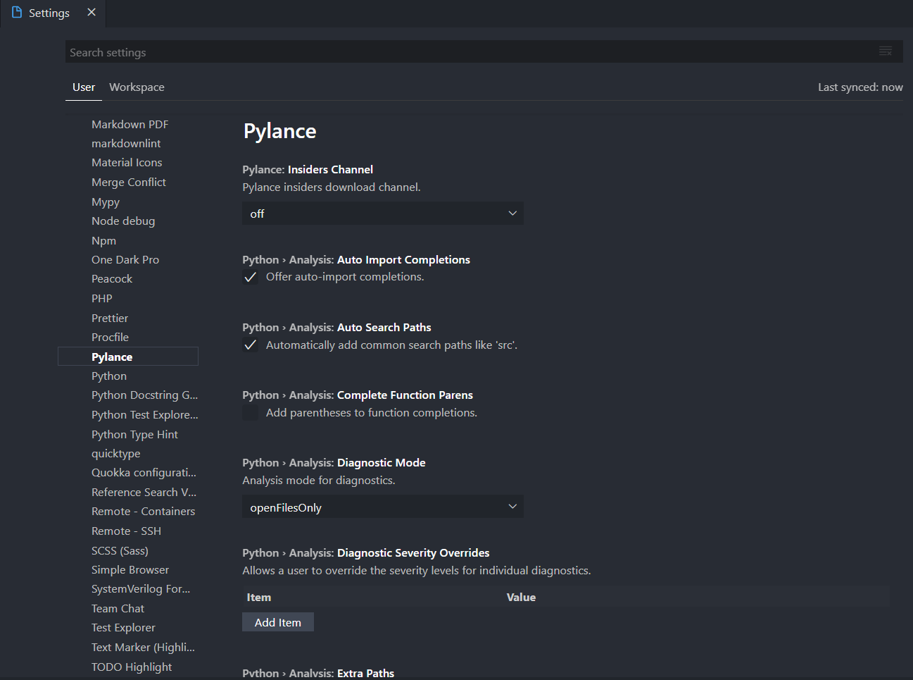
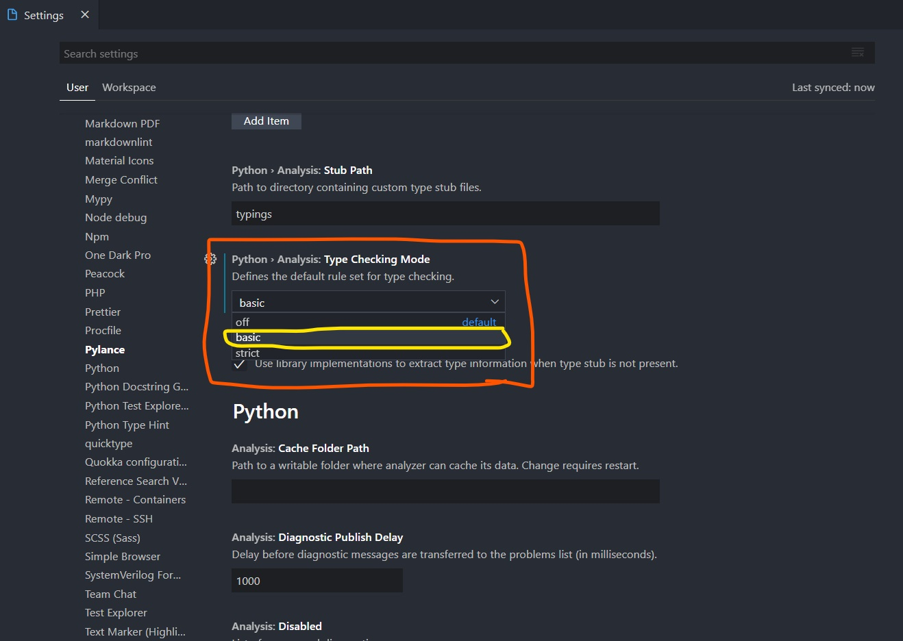

# EHL CODING STYLE GUIDE/BEST PRACTICES

## 1 Background

This document exists to increase the efficiency and productivity of both programmers (people who write code) and users (people who use code as tools for other tasks)
by defining clear and easy to follow guidlines for writing and maintaining code.

Without futher ado, the EHL style guide.

## 2 Code Editors

VSCode is the defacto code editor because it is easiest to configure, and has access to superior langauge servers for linting made by Microsoft.

### 2.1 VSCode

#### 2.1.1 Installation

For computers running Windows, Mac or Linux VSCode can be installed here: <https://code.visualstudio.com/download>

For RaspberryPis run these commands in the terminal:

    sudo apt update

    sudo apt install code

and VSCode will appear under the progamming tab:

reference: <https://code.visualstudio.com/docs/setup/raspberry-pi>

#### 2.1.2 Configuration

##### 2.1.2.1 Extensions

In VSCode you will find a button that looks like this where you can install extensions.

By default VSCode provides IntelliSense (suggestions on how to improve and/or bugfix code as you write it) only for Javascript, but this functionality is available for all other major languages as extensions.

Depending on the language you wish to program in, you should go to the extensions tab in VSCode and search for the name of that langauge. If there is an extension made by Microsoft, download that one. Otherwise, choose whichever is most popular.

Here a few recommended extensions to get you started (open a terminal in vs code and then paste these in and hit enter):

    code --install-extension aaron-bond.better-comments
    code --install-extension CoenraadS.bracket-pair-colorizer-2
    code --install-extension eamodio.gitlens
    code --install-extension Gruntfuggly.todo-tree
    code --install-extension mihelcic.colored-regions
    code --install-extension ms-python.python
    code --install-extension ms-python.vscode-pylance
    code --install-extension ms-vscode-remote.remote-containers
    code --install-extension ms-vscode-remote.remote-ssh
    code --install-extension ms-vscode-remote.remote-ssh-edit
    code --install-extension ms-vsliveshare.vsliveshare
    code --install-extension ms-vsliveshare.vsliveshare-pack
    code --install-extension njpwerner.autodocstring
    code --install-extension PKief.material-icon-theme
    code --install-extension Tyriar.terminal-tabs
    code --install-extension uctakeoff.vscode-counter
    code --install-extension wayou.vscode-todo-highlight
    code --install-extension zhuangtongfa.material-theme

##### 2.1.2.2 Python Specific Settings

Although Python allows for dynamic types, it is best practice to define variable types using the python `typing` library. You can do this by adding `from typing import <insert primitive datatype name here>` or just `from typing import *` if you're lazy.

VSCode will enforce these types by indicating that there are errors in your script only if you enable it in the Pylance Extension's settings.

To do so, click the settings button in the bottom left hand corner of the screen while in VSCode.

then click `Settings`

then click on `Extensions`

then click on `Pylance`

then scroll around and find the `Type Checking Mode` setting and set it to `basic`:

You're all set!

## 3 Coding Styles and Standards

It is critical to the EHL team that a standard is followed for coding so that code can be easily understood and reused. As the EHL continues to innovate and grow new languages will be introduced and new cases that are not explicitly covered in this guide will arise. In either event it is imperative that this style guide is updated to explain what to do and how to do it.

### 3.1 Python

For Python styling, reference: <https://google.github.io/styleguide/pyguide>

This is the standard by which all python code should be written.

A more condensed version of this document that is specific to EHL will come soon.

#### 3.1.1 Linting

The term linting refers to checking code for errors, whether by a human or a computer. VS Code's Pylance does an

excellent job of helping you to write error free code to begin with, but it doesn't make suggestions as to how your code 

should by formatted. For this, I use `yapf` <https://github.com/google/yapf> or `autopep8` <https://pypi.org/project/autopep8/>.

These can be installed from within VS Code in the Extensions tab. The extensions tab is discussed in greater detail in section `2.1.2.1`.

#### 3.1.2 Imports

* Use `import x` for importing packages and modules.
* Use `from x import y` where x is the package prefix and y is the module name with no prefix.
* Use `from x import y as z` if two modules named y are to be imported or if y is an inconveniently long name.
* Use `import y as z` only when z is a standard abbreviation (e.g., np for numpy).
  
For example the module sound.effects.echo may be imported as follows:

    from sound.effects import echo
    ...
    echo.EchoFilter(input, output, delay=0.7, atten=4)

Do not use relative names in imports. Even if the module is in the same package, use the full package name. This helps prevent unintentionally importing a package twice.

#### 3.1.3 Exceptions

Exceptions must follow certain conditions:

Make use of built-in exception classes when it makes sense. For example, raise a ValueError to indicate a programming mistake like a violated precondition (such as if you were passed a negative number but required a positive one). Do not use assert statements for validating argument values of a public API. assert is used to ensure internal correctness, not to enforce correct usage nor to indicate that some unexpected event occurred. If an exception is desired in the latter cases, use a raise statement. For example:

Yes:

    def connect_to_next_port(self, minimum):
        """Connects to the next available port.

        Args:
        minimum: A port value greater or equal to 1024.

        Returns:
        The new minimum port.

        Raises:
        ConnectionError: If no available port is found.
        """
        if minimum < 1024:
        # Note that this raising of ValueError is not mentioned in the doc
        # string's "Raises:" section because it is not appropriate to
        # guarantee this specific behavioral reaction to API misuse.
        raise ValueError(f'Min. port must be at least 1024, not {minimum}.')
        port = self._find_next_open_port(minimum)
        if not port:
        raise ConnectionError(
            f'Could not connect to service on port {minimum} or higher.')
        assert port >= minimum, (
            f'Unexpected port {port} when minimum was {minimum}.')
        return port

No:
    
    def connect_to_next_port(self, minimum):
        """Connects to the next available port.

        Args:
        minimum: A port value greater or equal to 1024.

        Returns:
        The new minimum port.
        """
        assert minimum >= 1024, 'Minimum port must be at least 1024.'
        port = self._find_next_open_port(minimum)
        assert port is not None
        return port

Libraries or packages may define their own exceptions. When doing so they must inherit from an existing exception class. Exception names should end in Error and should not introduce stutter (foo.FooError).

Never use catch-all except: statements, or catch Exception or StandardError, unless you are

re-raising the exception, or
creating an isolation point in the program where exceptions are not propagated but are recorded and suppressed instead, such as protecting a thread from crashing by guarding its outermost block.
Python is very tolerant in this regard and except: will really catch everything including misspelled names, sys.exit() calls, Ctrl+C interrupts, unittest failures and all kinds of other exceptions that you simply don’t want to catch.

Minimize the amount of code in a try/except block. The larger the body of the try, the more likely that an exception will be raised by a line of code that you didn’t expect to raise an exception. In those cases, the try/except block hides a real error.

Use the finally clause to execute code whether or not an exception is raised in the try block. This is often useful for cleanup, i.e., closing a file.

#### 3.1.4 Global Variables

Don't.

I'm somewhat kidding, feel free to use global variables as taught in CS 142/235 @ BYU. In short (and also terribly over simplified),

use globals for naming different numbers (integer, floats or otherwise) that would otherwise be ambiguous. Globals should help make

your code easier to understand, not make or break your code. If you find that your code relies on a global variable, most of the time

that means there is a better way to write your code.

Anyways, here is an example of using global variables to eliminate ambiguity.

    if (width > 320) and (height > 240):
        search_roi = create_search_rectangle(INITIAL_CAMERA_X, INITIAL_CAMERA_Y, INITIAL_BOX_X, INITIAL_BOX_Y) # returns the dimensions for the initial rectangle within which the camera should seach for a trapped particle.
        clean_snapshot.save("./pics/notrap-{}.jpg".format(time.time()))
        camera_output_status.high() # camera is not searching for a particle

On line one there are two "magic numbers" (320 and 240). "Magic numbers" are numbers that have meaning to whoever wrote the script, but just seem random to anyone else. 

The author of this script has only themselves to blame if those values are changed and the script fails as a result, they didn't indicate what those values meant!

The better way would be to define those variables as globals and name them something descriptive, or add a comment to describe their usage (or both).

#### 3.1.5 Generators and Comprehensions & One line conditionals

Generators and Comprehensions are ok to use for simple cases. One line conditionals should stylistically obey the same rules as Generators and Comprehensions which are as follows:

Each portion must fit on one line: mapping expression, for clause, filter expression. Multiple for clauses or filter expressions are not permitted. Use loops instead when things get more complicated.

Yes:

    result = [mapping_expr for value in iterable if filter_expr]

    result = [{'key': value} for value in iterable
                if a_long_filter_expression(value)]

    result = [complicated_transform(x)
                for x in iterable if predicate(x)]

    descriptive_name = [
        transform({'key': key, 'value': value}, color='black')
        for key, value in generate_iterable(some_input)
        if complicated_condition_is_met(key, value)
    ]

    result = []
    for x in range(10):
        for y in range(5):
            if x * y > 10:
                result.append((x, y))

    return {x: complicated_transform(x)
            for x in long_generator_function(parameter)
            if x is not None}

    squares_generator = (x**2 for x in range(10))

    unique_names = {user.name for user in users if user is not None}

    eat(jelly_bean for jelly_bean in jelly_beans
        if jelly_bean.color == 'black')

No:

    result = [complicated_transform(
                    x, some_argument=x+1)
                for x in iterable if predicate(x)]

    result = [(x, y) for x in range(10) for y in range(5) if x * y > 10]

    return ((x, y, z)
            for x in range(5)
            for y in range(5)
            if x != y
            for z in range(5)
            if y != z)

Although it isn't shown in the code snippets, I find it neatest to put the mapping expression, for clause, and filter expression (if there is one) each on their 

own line. It isn't required but is a nice touch for those looking to go the extra mile to write pretty code.

Example:

    result = [
        expression
        for expression in expressions
        if expression
    ]

Conditional Example

    if not var: raise ValueError()

#### 3.1.6 Lambda functions

Ok to use if the function is a one liner or if you want an anonymous function. Best to just define an actual function if you can so as to be more explicit

for those who will read and reuse your code after you.

### 3.1 C++

Follow the guidelines as taught in the CS 142/235 courses @ BYU.

A summary of these will be provided soon.